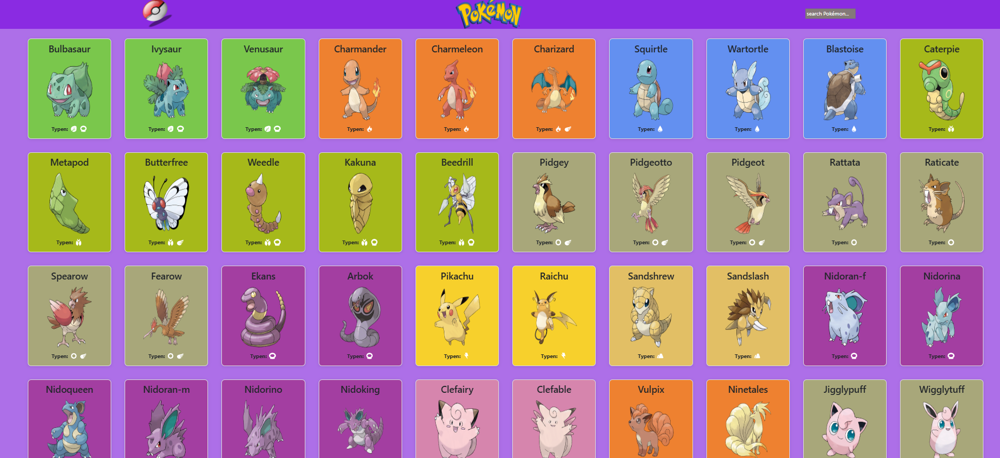

# 🐉 Pokédex

Ein interaktiver Pokédex, entwickelt mit HTML, CSS und JavaScript.

## 🌐 Live Demo

👉 https://janetbughardt.github.io/pokedex/

## 📖 Projektbeschreibung

Dieses Projekt nutzt die offizielle PokéAPI, um Pokémon-Daten dynamisch abzurufen und darzustellen. Ziel war es, den Umgang mit REST-APIs, JSON-Daten und JavaScript zu vertiefen sowie eine responsive und benutzerfreundliche Webanwendung zu entwickeln.

## ✨ Funktionen

- Dynamisches Laden der Pokémon über die PokéAPI
- Suchfunktion zum Filtern von Pokémon
- Detailansicht im Overlay
- Responsive Design
- Dynamische Generierung der Pokémon-Karten
- Verarbeitung von JSON-Daten mit der Fetch API

## 🛠️ Verwendete Technologien

- HTML5
- CSS3
- JavaScript (ES6)
- Fetch API
- REST API
- JSON

## 📷 Screenshots

### Homepage

### Search Function

## 🚀 Was ich bei diesem Projekt gelernt habe

- Arbeiten mit REST-APIs
- Abrufen und Verarbeiten von JSON-Daten
- Asynchrone Programmierung mit `fetch()`
- Strukturierung von JavaScript in mehrere Dateien
- Entwicklung einer responsiven Benutzeroberfläche

## 👩‍💻 Entwickelt von

Janet Burghardt
